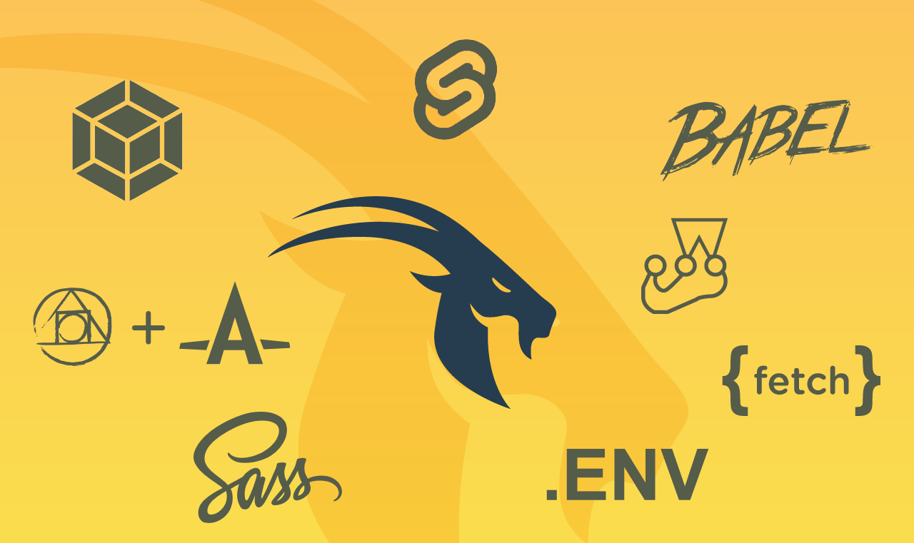
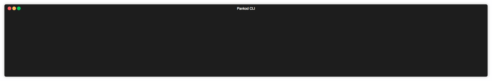

<br/>
<br/>
<div align="center">Svelte application boilerplate with Webpack, Babel, PostCSS, Sass, Fetch, Jest, .Env, EsLint.</div>
<br/>

<div align="center">
  <!-- CodeClimate -->
<a href="https://codeclimate.com/github/pankod/svelte-boilerplate/maintainability">

</a>
  <!-- TestCoverage -->
<a href="https://codeclimate.com/github/pankod/svelte-boilerplate/test_coverage"></a>
  <!-- Build Status -->
  <a href="https://travis-ci.org/pankod/svelte-boilerplate">
    
  </a>
  <!-- Dependency Status -->
  <a href="https://david-dm.org/pankod/svelte-boilerplate">
    
  </a>
  <!-- devDependency Status -->
  <a href="https://david-dm.org/pankod/svelte-boilerplate#info=devDependencies"> 
    
  </a>
</div>

<br/>
<div align="center">
This boilerplate make it easier to get started with a well-structured Svelte application.
<br />
<br />
  <sub>Created by <a href="https://www.pankod.com">Pankod</a></sub>
</div>


## About

 Svelte is a new approach to building user interfaces. Whereas traditional frameworks like React and Vue do the bulk of their work in the browser, Svelte shifts that work into a compile step that happens when you build your app.

 Svelte runs at build time, converting your components into pure and optimized JavaScript code without other framework dependencies which makes for really tiny bundles. Instead of using techniques like virtual DOM diffing, Svelte writes code that surgically updates the DOM when the state of your app changes. So there is no virtual DOM, no frameworks on top of frameworks, and no framework to load at runtime.
 
 The advantages of this approach is we're able to write applications with excellent performance characteristics.

This boilerplate make it easier to get started with a well-structured Svelte application.

By the end of setup, you'll have a Svelte project and features which is specified at the below.

<br/>

## Features


This boilerplate includes the latest powerfull tools.

* **Svelte** - Component framework which compiles your code to tiny, framework-less vanilla JS. 
* **Built-in Project CLI**- Create pages, components, actions, reducers with one command by using built-in cli.
* **Sass/Scss** - CSS preprocessor, which adds special features such as variables, nested rules and mixins (sometimes referred to as syntactic sugar) into regular CSS.
* **PostCSS/autoprefixer** - A plugin to parse CSS and add vendor prefixes to CSS rules using values from Can I Use.
* **Babel** -  The compiler for next generation JavaScript.(babel/polyfill included)
* **Eslint** - The pluggable linting utility.
* **dotenv .config** - Expose environment variables to the runtime config of Next.js
* **Jest** - Javascript testing framework , created by developers who created react
* **testing-library** - Simplifies the use of dom-testing with Svelte components & applications.
* **webpack** - A static module bundler for modern JavaScript applications.
* **fetch** - A promise-based mechanism for programmatically making web requests in the browser.

<br/>


## Setup & Documentation

Please refer to our [setup guide](https://pankod.github.io/svelte-boilerplate/docs/setup) to create a new app. 


For more detailed documentation, check out https://pankod.github.io/svelte-boilerplate/

<br/>

## Built-in CLI


<div>
 
</div>
<br/>
<br/>

Pankod boilerplate is shipped with a CLI tool to streamline the creation of new components. By using the CLI tool, you may easily add components to your project.
<br />

To start the CLI, you may run the following npm command:

```
npm run cli
```

After starting, an interactive menu will let you configure the component the be created. You'll be asked for the name of the component.

After answering question it generates component, style and test files in miliseconds.

<br/>


## License

Licensed under the MIT License, Copyright © 2019-present Pankod


