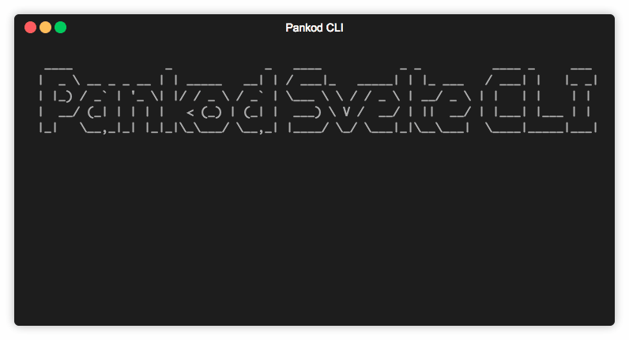

<div>
 
</div>
<br/>
<br/>

Pankod boilerplate is shipped with a CLI tool to streamline the creation of new components. By using the CLI tool, you may easily add component, style and test files to your project and have all the required imports are automatically created for you.

To start the CLI, you may run the following npm command:

```sh
npm run cli
```

